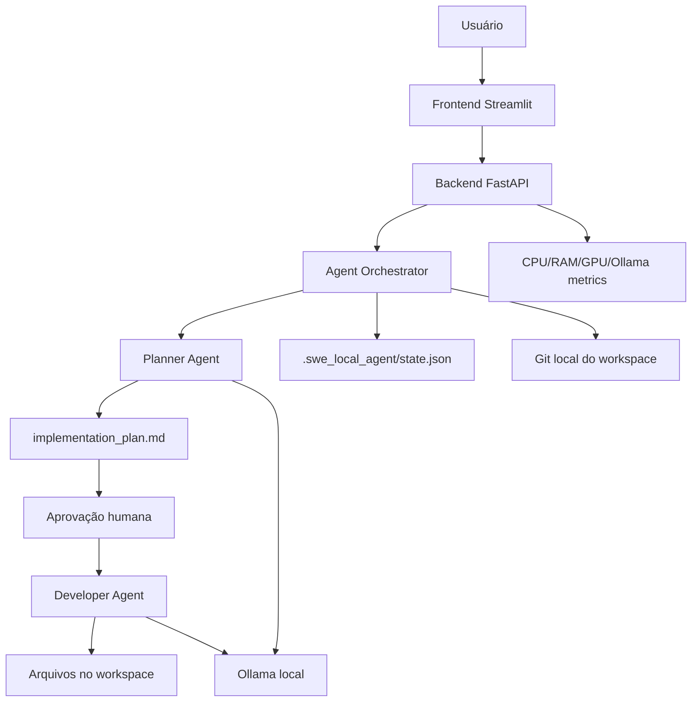

# SWE Local Agent

[](https://www.python.org/)
[](https://fastapi.tiangolo.com/)
[](https://streamlit.io/)
[](https://ollama.com/)
[](https://opensource.org/licenses/MIT)

**SWE Local Agent** é uma plataforma local de desenvolvimento assistido por agentes de software. Ela roda offline, usa modelos locais via Ollama, cria planos de implementação, aguarda aprovação humana e depois gera arquivos reais em workspaces isolados com rastreabilidade por estado JSON, logs, métricas e Git local.

O projeto foi desenhado para implementar e validar, em hardware comum, um fluxo de engenharia parecido com ferramentas modernas de coding agents: planejamento, revisão, execução, auditoria e comparação objetiva de desempenho. A diferença central é que tudo acontece na máquina local, sem depender de API externa para inferência.

## Diferenciais da Plataforma

- **100% local e offline para inferência**: Planner e Developer usam modelos registrados no Ollama.
- **Modelos intercambiáveis**: a GUI lista os modelos disponíveis e permite testar outras combinações.
- **Fluxo estruturado de dois estágios**: `Planner Agent -> aprovação humana -> Developer Agent`.
- **Workspaces isolados**: cada projeto gerado fica em `workspaces/<project_id>`.
- **Estado auditável**: cada execução persiste `state.json`, plano, arquivos criados, métricas e snapshots de hardware.
- **Aceleração por GPU integrada AMD via Vulkan**: validada no Lenovo IdeaPad S145-15API com Radeon Vega 8 integrada.
- **Observabilidade real**: CPU, RAM, temperatura, GPU, memória compartilhada e status do Ollama aparecem no app e no registro da execução.
- **Evidência de qualidade sem travar o fluxo**: o backend registra `quality_checks` no `state.json`, mas não bloqueia o Planner nem polui a UI.
- **Segurança de escrita**: sandbox de caminhos impede escrita fora do workspace do projeto.
- **Portabilidade**: backend FastAPI, frontend Streamlit e CLI Python.

## Demonstração e Fluxo de Execução

O SWE Local Agent opera seguindo etapas estruturadas para garantir previsibilidade e controle:

1. **Workspace**: O usuário cria ou seleciona um diretório de trabalho isolado.
2. **Definição de Modelos**: Seleção dos modelos do Planner e do Developer disponíveis no Ollama.
3. **Solicitação**: Envio do pedido de desenvolvimento.
4. **Planejamento**: O Planner cria o `implementation_plan.md`.
5. **Aprovação**: O usuário revisa o plano e aprova ou solicita ajustes.
6. **Desenvolvimento**: O Developer gera os arquivos físicos usando o contrato `[FILE: caminho]`.
7. **Rastreabilidade**: O sistema registra logs, timer, snapshots de hardware, arquivos criados e realiza commits Git locais automáticos.

> [!NOTE]
> O Planner não deve escrever código-fonte final e o Developer não deve replanejar a tarefa. Essa divisão de responsabilidades mantém o fluxo previsível e simplifica a auditoria.

Veja abaixo a demonstração em vídeo do fluxo completo em ação:

<video src="https://github.com/user-attachments/assets/e1a240bc-a71c-43a2-9f07-aa4e147836ec" controls width="100%"></video>

## Motivação e Objetivos

Rodar agentes de desenvolvimento localmente é difícil por três motivos: modelos consomem memória, inferência pode ser lenta e modelos locais pequenos tendem a encurtar ou desviar tarefas quando o prompt não é bem controlado.

Este projeto ataca esses três pontos:

1. **Performance**: usa Ollama com `keep_alive`, `use_mmap` e, quando disponível, GPU/Vulkan.
2. **Qualidade**: separa planejamento e desenvolvimento, com prompt mais explícito e aprovação humana.
3. **Evidência**: cada teste deixa rastros comparáveis em `state.json`, incluindo tempo, TPS, arquivos e hardware usado.

O resultado é uma solução de engenharia agêntica com medições reais.

## Proposta e Evolução Técnica

O desenvolvimento do **SWE Local Agent** foca em otimizar o ciclo de desenvolvimento agêntico local e offline, permitindo melhorias mensuráveis na execução:

- **Evolução de Hardware**: transição de inferência estritamente em CPU para aceleração por GPU integrada (iGPU/Vulkan);
- **Rastreabilidade**: logs de hardware em tempo real, tokens por segundo (TPS) e tempo de execução por agente;
- **Modularização Consistente**: melhorias nos prompts de Planner e Developer para garantir o escopo exato solicitado, evitando a inflação de arquivos ou desvios de lógica;
- **Loop de Feedback**: interação humana simplificada para revisão e aprovação do plano de implementação antes da escrita do código.

O principal diferencial do projeto é que a eficiência de cada etapa e modelo pode ser quantificada sistematicamente, viabilizando otimizações baseadas em dados empíricos de performance registrados no `state.json`.

## Arquitetura



### Componentes

| Componente | Responsabilidade |
| --- | --- |
| `app_backend/main.py` | API FastAPI, SSE, estado dos projetos, aprovação, parada, métricas de sistema |
| `app_backend/agent_orchestrator.py` | Fluxo Planner/Developer, prompts, parsing de arquivos, métricas, snapshots e quality evidence |
| `app_backend/ollama_client.py` | Cliente HTTP do Ollama, streaming, `<think>`, `keep_alive`, métricas de inferência |
| `app_backend/system_metrics.py` | Leitura passiva de CPU, RAM, temperatura, GPU AMD e modelos carregados no Ollama |
| `app_backend/security.py` | Sandbox de caminhos e validação de operações |
| `app_backend/git_manager.py` | Git local por workspace |
| `app_gui/main.py` | Interface Streamlit com chat, explorador, visualizador, logs e rodapé de hardware |
| `app_cli/main.py` | Interface CLI por terminal usando o mesmo backend lógico |
| `workspaces/` | Projetos gerados e evidências de execução |

## Modelos Offline

O SWE Local Agent não é preso a um único modelo. Ele conversa com o Ollama, consulta os modelos disponíveis e deixa o usuário selecionar combinações para cada papel.

Isso significa que novos modelos podem ser testados sem reescrever a aplicação. Basta registrá-los no Ollama, abrir a GUI e escolher o modelo desejado para Planner ou Developer.

### Modelos Já Testados e Validados

| Modelo Base | Nomes Registrados (Ollama) | Papel Recomendado | Observação Técnica |
| --- | --- | --- | --- |
| **Qwen 2.5 Coder 7B** | `qwen2.5-coder-7b-local` / `:latest` | Developer | Principal modelo de desenvolvimento. Altamente preciso. Tornou-se extremamente viável com a aceleração por GPU/Vulkan ativada. |
| **Qwen 2.5 Coder 3B** | `qwen2.5-coder-3b-developer` / `-local` | Developer / Planner | Excelente equilíbrio entre velocidade e consumo. Útil para tarefas menores ou hardware com menos memória disponível. |
| **Llama 3.2 3B** | `llama3.2-3b-planner` / `-local` | Planner | Testado para planejamento leve. Funciona bem, mas se mostrou mais lento em benchmarks comparativos. |
| **Qwen 2.5 Coder 1.5B** | `qwen2.5-coder-1.5b-qa:latest` | Planner | Excelente para estruturação rápida e geração de planos, alcançando cerca de 13,9 TPS na execução local. |


### Combinação Recomendada Hoje

Para o benchmark de app simples em Python, a melhor combinação observada foi:

```text
Planner:   qwen2.5-coder-1.5b-qa:latest
Developer: qwen2.5-coder-7b-local:latest
Runtime:   Ollama com GPU/Vulkan ativa na AMD Radeon Vega 8 integrada
```

Essa combinação preservou qualidade melhor que as tentativas com Planner maior e manteve a execução eficiente.

## Suporte a Hardware e Aceleração (Vulkan/iGPU)

Para maximizar a velocidade de inferência local (TPS - Tokens Por Segundo) sem depender de GPUs dedicadas de alto custo, a plataforma suporta aceleração gráfica via **Vulkan** para **GPUs Integradas (iGPU)** que compartilham a memória RAM do sistema.

### Configuração do Ollama para iGPU/Vulkan (Linux)

Para ativar a aceleração gráfica integrada no serviço do Ollama, configure as variáveis de ambiente necessárias no serviço do systemd:

1. Abra a edição de override do serviço:
   ```bash
   sudo systemctl edit ollama
   ```
2. Adicione a configuração abaixo no bloco `[Service]`:
   ```ini
   [Service]
   Environment="OLLAMA_VULKAN=1"
   Environment="GGML_VK_VISIBLE_DEVICES=0"
   Environment="OLLAMA_IGPU_ENABLE=1"
   ```
3. (Opcional) Conceda permissão de monitoramento de performance para o Ollama:
   ```bash
   sudo setcap cap_perfmon+ep $(which ollama)
   ```
4. Recarregue as configurações e reinicie o serviço:
   ```bash
   sudo systemctl daemon-reload
   sudo systemctl restart ollama
   ```

### Validação

Durante uma inferência ativa, execute:
```bash
ollama ps
```
Verifique se a coluna `PROCESSOR` indica o uso de aceleração por GPU (ex: `100% GPU`). *Nota: Em setups de iGPU compartilhada (como AMD Radeon Vega), o Ollama consome a RAM do sistema de forma compartilhada.*

### Monitoramento de Recursos e Segurança Térmica

Como execuções locais de agentes podem exigir processamento contínuo:
- Acompanhe a temperatura do processador (exibida diretamente no dashboard da GUI).
- Certifique-se de manter o notebook/desktop em local bem ventilado.
- Libere a memória do sistema descarregando modelos não utilizados.

## Gerenciamento de Memória e Recursos

Para ver modelos carregados:

```bash
ollama ps
```

Para descarregar um modelo específico:

```bash
ollama stop qwen2.5-coder-7b-local:latest
```

Para descarregar outro modelo:

```bash
ollama stop qwen2.5-coder-1.5b-qa:latest
```

Se `keep_alive` estiver alto, o modelo pode permanecer pronto por mais tempo. Isso é bom para velocidade, mas consome RAM/memória compartilhada enquanto estiver carregado.

## Benchmarks Recentes

Os testes abaixo usam workspaces reais em `workspaces/app_task_*`, com estado persistido em `.swe_local_agent/state.json`.

| Teste | Condição | Planner | Developer | Total ativo | TPS Planner | TPS Developer | Resultado |
| --- | --- | --- | --- | ---: | ---: | ---: | --- |
| `app_task_2` | Antes da GPU, CPU | `qwen2.5-coder-1.5b-qa` | `qwen2.5-coder-7b-local` | 771,39s | 5,98 | 1,73 | Funcional, mas lento |
| `app_task_3` | Após GPU/Vulkan | `qwen2.5-coder-1.5b-qa` | `qwen2.5-coder-7b-local` | 354,70s | 14,05 | 3,34 | Grande ganho de performance |
| `app_task_4` | GPU, prompt ainda frouxo | `qwen2.5-coder-1.5b-qa` | `qwen2.5-coder-7b-local` | 117,14s | 14,07 | 3,67 | Rápido, mas desviou para Pomodoro |
| `app_task_5` | Planner Llama 3.2 3B | `llama3.2-3b-planner` | `qwen2.5-coder-7b-local` | 231,29s | 6,65 | 3,53 | Mais lento e ainda com desvio |
| `app_task_6` | Prompt benchmark reforçado | `qwen2.5-coder-1.5b-qa` | `qwen2.5-coder-7b-local` | 247,01s | 13,85 | 3,42 | Aviso de modularidade |
| `app_task_7` | Benchmark repetido | `qwen2.5-coder-1.5b-qa` | `qwen2.5-coder-7b-local` | 251,61s | 13,88 | 3,26 | Aviso por excesso de arquivos |
| `app_task_8` | Sweet spot de escopo | `qwen2.5-coder-1.5b-qa` | `qwen2.5-coder-7b-local` | 180,59s | 13,93 | 3,53 | `quality_checks: passed` |
| `app_task_11` | Otimização de GUI e Latência (Vídeo Demo) | `qwen2.5-coder-1.5b-qa` | `qwen2.5-coder-7b-local` | 277,97s | 12,00 | 2,85 | `quality_checks: passed` |

Leitura importante: o teste mais rápido não foi automaticamente o melhor. `app_task_4` foi veloz, mas desviou o domínio para Pomodoro. O sweet spot atual veio quando performance e prompt/escopo ficaram equilibrados.

## Prompt de Benchmark Recomendado

Use este prompt para repetir testes comparáveis:

```text
Desenvolva um app simples para controle de atividades diárias em Python.

Requisitos obrigatórios:
- Permitir cadastrar uma atividade com título e descrição opcional.
- Permitir listar todas as atividades.
- Permitir marcar uma atividade como concluída.
- Permitir remover uma atividade.
- Manter os dados em memória durante a execução.
- Usar interface de terminal simples com menu numérico.
- Ser minimamente modular, sem exagerar na quantidade de arquivos.

Critérios de aceite:
- O usuário consegue cadastrar, listar, concluir e remover atividades pelo terminal.
- Atividades concluídas aparecem diferenciadas na listagem.
- O app não deve implementar Pomodoro, cronômetro, timer ou agenda.
- O código deve rodar com Python puro, sem dependências externas.
```

Esse prompt deixa claro o domínio, as funções mínimas e o que está fora de escopo.

## Estrutura do `state.json`

Cada workspace mantém um arquivo:

```text
workspaces/<project_id>/.swe_local_agent/state.json
```

Campos principais:

| Campo | Finalidade |
| --- | --- |
| `prompt` | Pedido original do usuário |
| `plan_content` | Conteúdo atual do `implementation_plan.md` |
| `files_created` | Arquivos gerados pelo Developer |
| `log_messages` | Log estruturado de execução |
| `metrics` | Métricas por agente, incluindo duração, tokens e TPS |
| `execution_timer` | Tempo ativo por fase |
| `runtime` | Estado visual para recuperar a UI durante streaming |
| `hardware_snapshots` | CPU, RAM, temperatura, GPU e Ollama no início/fim das fases |
| `quality_checks` | Evidência técnica de aderência ao escopo, sem bloquear o fluxo |

O `state.json` é uma das partes mais importantes do projeto porque permite realizar análises comparativas de forma sistemática e objetiva.

## Guia de Instalação e Execução

### 1. Instalar dependências

```bash
python3 -m venv venv
source venv/bin/activate
python -m pip install --upgrade pip
pip install fastapi uvicorn streamlit psutil httpx httpx-sse GitPython langgraph langchain-core typing-extensions pytest
```

### 2. Validar Ollama

```bash
curl http://localhost:11434/api/tags
ollama list
```

### 3. Subir backend

```bash
source venv/bin/activate
uvicorn app_backend.main:app --host 127.0.0.1 --port 8000 --reload
```

### 4. Subir frontend

```bash
source venv/bin/activate
streamlit run app_gui/main.py --server.port 8501 --server.address 127.0.0.1
```

Abra:

```text
http://127.0.0.1:8501
```

### 5. Rodar via CLI

```bash
source venv/bin/activate
python -m app_cli.main \
  --workspace demo_cli \
  --planner-model qwen2.5-coder-1.5b-qa:latest \
  --developer-model qwen2.5-coder-7b-local:latest \
  --auto-approve \
  --prompt "Crie uma agenda de contatos simples em Python puro para terminal."
```

### 6. Variáveis de Ambiente

O comportamento da aplicação pode ser customizado utilizando as seguintes variáveis de ambiente:

| Variável | Tipo | Padrão | Descrição |
| --- | --- | --- | --- |
| `OLLAMA_NUM_THREAD` | Inteiro | Auto | Sobrescreve o número de threads da CPU para inferência no Ollama. |
| `OLLAMA_KEEP_ALIVE` | String | `5m` | Tempo de permanência do modelo na memória do Ollama após a execução. |
| `SWE_AGENT_FAST_START` | Booleano | `true` | Habilita/desabilita o pré-aquecimento dos modelos padrão na inicialização do backend. |
| `SWE_AGENT_FAST_START_MODELS` | String | `""` | Lista separada por vírgula de modelos adicionais para pré-aquecer na inicialização. |

### 7. Fluxo de Teste Recomendado

Para validar a instalação e medir o desempenho do seu ambiente local:

1. Inicialize o serviço do Ollama com os modelos de sua preferência.
2. Na interface gráfica do SWE Local Agent, selecione os modelos correspondentes para os papéis de **Planner** e **Developer**.
3. Execute uma tarefa de teste utilizando o prompt de controle de atividades contido no guia de benchmark acima.
4. Valide a entrega acompanhando os arquivos criados no diretório do workspace (`workspaces/<project_id>`).
5. Analise as métricas de tempo total, TPS (tokens por segundo) e consumo de hardware no arquivo `.swe_local_agent/state.json` gerado para o projeto.

A capacidade de quantificar a eficiência de cada etapa e modelo de forma empírica permite otimizar o fluxo e calibrar prompts para obter a melhor performance no hardware disponível.

## Validação Técnica

```bash
source venv/bin/activate
python -m py_compile app_backend/agent_orchestrator.py app_backend/main.py app_backend/ollama_client.py app_backend/system_metrics.py app_gui/main.py app_cli/main.py
python -m pytest app_backend/tests/test_backend.py -q
python -m app_cli.main --help
```

## Segurança

O projeto trata o filesystem como superfície crítica:

- arquivos só podem ser escritos dentro do workspace ativo;
- paths são resolvidos com `Path.resolve()`;
- tentativas de path traversal são bloqueadas;
- comandos perigosos são rejeitados pelo sandbox;
- cada workspace tem Git local para auditoria;
- logs e estado ficam no projeto, não espalhados pelo sistema.

## Princípios de Projeto e Engenharia

O objetivo não é ter muitos agentes. O objetivo é ter o número certo de agentes para o hardware disponível.

Por isso o MVP usa:

- um Planner para estruturar;
- uma aprovação humana para controlar escopo;
- um Developer para escrever arquivos;
- observabilidade para medir;
- evidência silenciosa de qualidade para analisar depois.

Essa combinação evita transformar a solução em uma esteira lenta e frágil. Em máquina local, arquitetura enxuta é uma decisão de engenharia, não limitação.

## Roadmap

Melhorias naturais para os próximos ciclos:

- runner de benchmark com relatório comparativo automático;
- score de qualidade visível apenas em modo análise;
- validação pós-geração com `py_compile` quando o projeto for Python;
- perfil de execução por hardware, como CPU puro, Vulkan iGPU e modelos leves;
- Intent Router para separar conversa comum de nova tarefa de desenvolvimento;
- exportação de relatório técnico por workspace;
- suporte a mais templates de prompt por tipo de projeto;
- empacotamento do ambiente para simplificar a distribuição.

## Licença

Este projeto está licenciado sob a Licença MIT. Consulte o arquivo [LICENSE](LICENSE) para obter mais informações.
